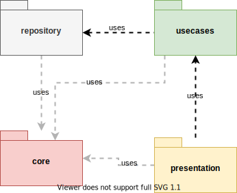

# Welcome!

- This repository provides an Android project that uses the library  [Movie DB API](https://www.themoviedb.org)

## Architecture

## Coverage 

> _Last update 12/08/20_

| Layer                | Coverage (% classes)      |
|----------------------|:-------------------------:|
| core                 | _58%_                     |
| domain               | _93%_                     |
| presentation         | _15%_                     |
| repository           | _64%_                     |

Total: _44%_

## Stack Overview

| Type                 | Current Implementation  |
|----------------------|:-----------------------:|
| Architecture         | MVVM                    |
| Dependency Injection | Hilt                    |
| Load Images          | Glide                   |
| View Binding         | ViewBinding             |
| Handler to IO calls  | Coroutines              |
| Unit Tests           | JUnit, Truth, mockK     |
| UI Tests             | Espresso, Truth         |
| Network calls        | Retrofit                |
| Json converter       | Retrofit - Gson         |
| Persistence          | Room                    |

## Teaser

- [Night mode](img/dark-theme-support.gif)
