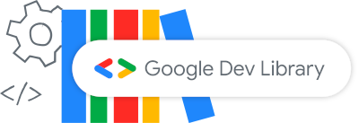
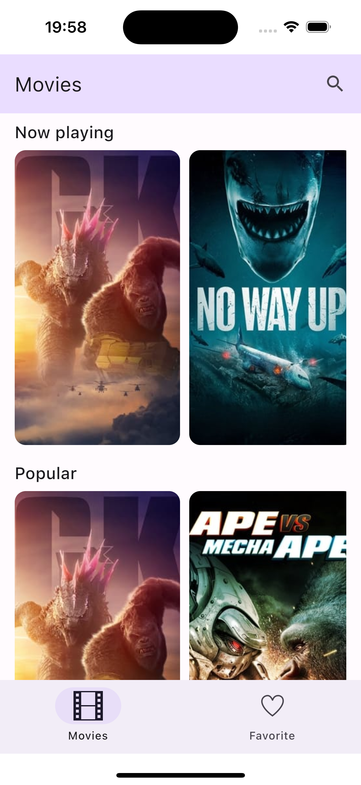

<a href="https://devlibrary.withgoogle.com/products/android/repos/gabrielbmoro-MovieDB-Android">
    
</a>

[](https://app.bitrise.io/app/4aa44eea-43cf-4a4d-8996-5ed6f48d9512)
[](http://kotlinlang.org)


[](https://github.com/gabrielbmoro/MovieDB-Android/issues)

# Welcome! 👋

Welcome to the MovieDB-App! If you like movies, you will like this app, because you can access the most popular and top rated movies 🤩

---

## How to run the project 📦

1. Install Android Studio (latest version);
2. Select the option to open a project;
3. Select the project -> ⚠️ The project is inside of the `src` directory ⚠️

🍎 If you wants to run the iOS app, you should open the file `iosApp/iosApp.xcodeproj` using Xcode (latest version).

🤖 Otherwise, you can run the Android app opening the src file using the Android Studio.

---

## How to get my access token? 👮 

1. Create an account [Movie DB API](https://www.themoviedb.org) (if you don't have it);
2. Copy the value of your [Bearer token](https://developer.themoviedb.org/docs/authentication-application#bearer-token);
3. Paste the value of your token your `gradle.properties` file (_Global properties_):

If your bearer token is:
```
Bearer cHuckNoRRisIsAWarRior
```

Your `gradle.properties` file (_Global properties_) should looks like:

```
MOVIE_DB_API_TOKEN=cHuckNoRRisIsAWarRior
```

---

## Teaser 🎬

- 🤖 **Android**


- 🍎 **iOS**



---

### Tech stack summary 🛠️

- [Compose Multiplatform](https://www.jetbrains.com/lp/compose-multiplatform)
- [Voyager](https://voyager.adriel.cafe) - MVVM & navigation
- [Koin](https://github.com/InsertKoinIO/koin) - Dependency injection
- [Rinku](https://github.com/theolm/Rinku) - Deep links
- Coroutines
- [Ktor](https://ktor.io) - Network requests
- [Moko Resources](https://github.com/icerockdev/moko-resources) - Multiplatform resources
- [Kamel](https://github.com/Kamel-Media/Kamel) - Image loader
- Room - Android Database
- Gradle Catalogs - Dependency management
- [Android YouTube Player](https://github.com/PierfrancescoSoffritti/android-youtube-player) - Android video player
- [BuildKonfig](https://github.com/yshrsmz/BuildKonfig) - Gradle variables

---

## Wiki 📚

More details about the project you can visit the [Wiki](https://github.com/gabrielbmoro/MovieDB-Android/wiki). 
