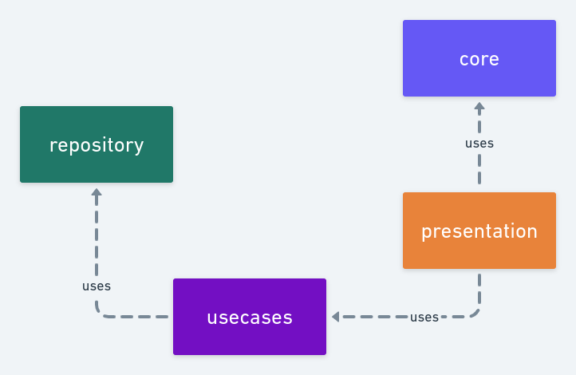

[](https://www.android.com/)[](https://kotlinlang.org/)[](https://app.bitrise.io/app/4aa44eea-43cf-4a4d-8996-5ed6f48d9512)

# Welcome!

---

## Setup

After create an account at [Movie DB API](https://www.themoviedb.org), you will have a token to access the API. 

You should specify the token in your `gradle.properties` file.


```
MOVIE_DB_API_TOKEN_DEBUG=<token here>
MOVIE_DB_API_TOKEN_RELEASE=<token here>
```

---

## Teaser


---

## Architecture and Stack Overview



### Architecture

**Repository**

- This layer provides an interface used as a repository. It provides a single abstraction to interact with differents Data Sources.

**Repository -> Mappers**

- They are used to convert the data objects to entity objects recognized by the domain layer.

**Repository->API**

- The APP fetches data from the [Movie DB API](https://www.themoviedb.org). There is a code infrastructure using *Retrofit* where it is possible to keep this communication between the app and the server.

**Repository -> Local Data Base**

- The user can select their favorite movies and store them on a local database. There is a code layer using the *Room* library to keep easy the communication between the app and the Data Base.

**Repository -> Local preferences**

- The user can also define which is the application theme. Currently, the app supports night mode, light mode, and automatic (defined by Android OS).

**Use Cases**

- This layer is the way used by `ViewModels` to access the repository.

**UI**

- Contains all elements required to build the user interface.

**UI -> screens**

- Each package inside of screens represents a screen.

- A screen is defined by a `Composable` function that represents the screen itself, a `ViewModel` related, and a data holder object which represents the UI state for that screen.

**UI -> common**

- `Composable` widgets, navigation graph definition, and others.

**Core**

- The core layer starts the Dependency injection engine, the network setup, and the database configuration.

---

### Tech Stack Summary

- Compose, Koin, Coroutines, Retrofit, Room, Mockk, Gradle Catalogs.